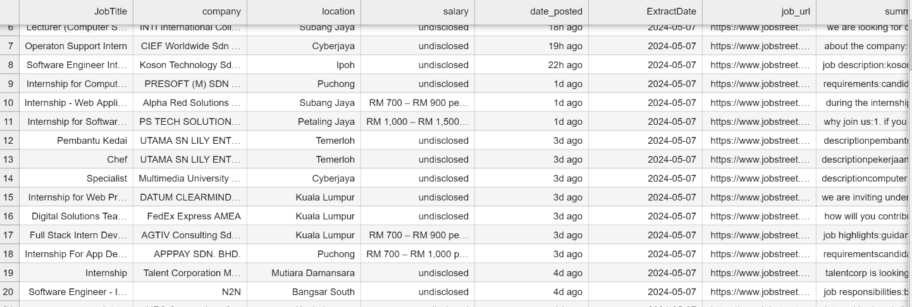

# Job Listings from JobStreet

## Dataset Overview

This dataset contains job listings scrapped from www.jobstreet.com.my, including various attributes such as job title, company, location, salary, job posted date, extracted date, job URL, job summary, review URL, overall rating, and number of ratings. This was done by utlizing  Selenium and BeautifulSoup in Python.

## Attributes Description

- **Job Title**: The title of the job position.
- **Company**: The name of the company offering the job.
- **Location**: The location of the job.
- **Salary**: The salary offered for the job position.
- **Job Posted Date**: The date when the job was posted.
- **Extracted Date**: The date when the data was extracted from the JobStreet website.
- **Job URL**: The URL link to the job posting.
- **Job Summary**: A brief summary or description of the job.
- **Review URL**: The URL link to the company reviews.
- **Overall Rating**: The overall rating of the company.
- **Number of Ratings**: The number of ratings or reviews the company has received.

## Example of scrapped job data 
